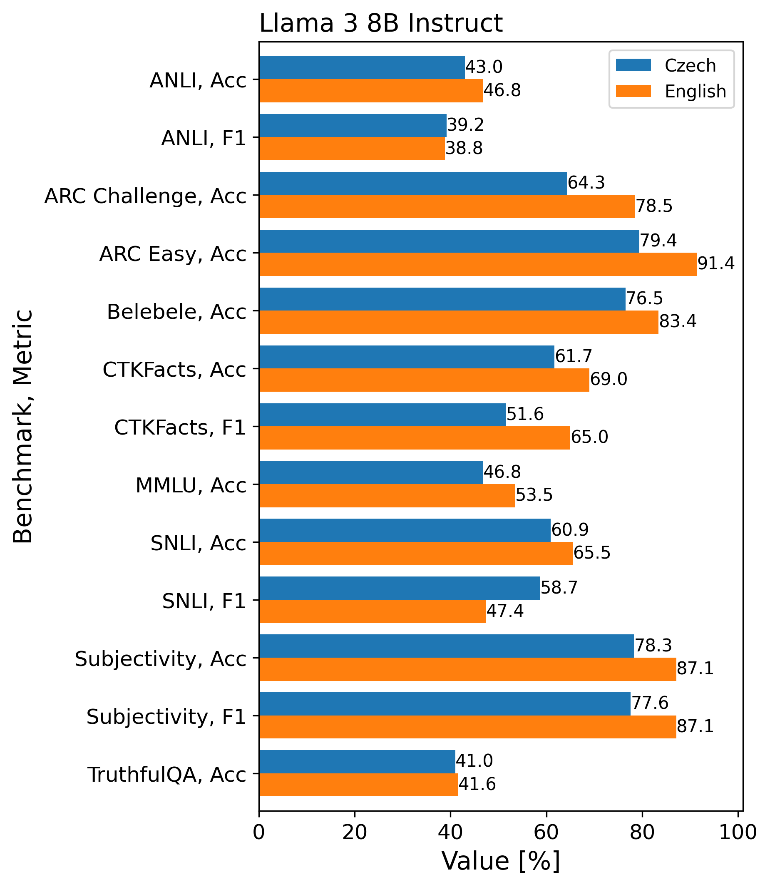

# Czech-Bench evaluation results

This file presents the results obtained when evaluating selected LLMs using Czech-Bench. The included tables and figures, as well as the written commentaries are adopted from my recently submitted [master's thesis](#references).

## GPT-3.5 Turbo vs Claude 3 Haiku

The table below captures the performance achieved by GPT-3.5 Turbo (0125) and Claude 3 Haiku (20240307). It is apparent that Claude 3 Haiku shows significantly superior performance
in most Czech Benchmarks, as well as all natural language inference tasks in both
languages. GPT-3.5 Turbo takes the lead in a minority of mostly English benchmarks.
Its winning margins are small in most cases, with a clear exception in the SQAD
dataset. Claude
also appears to provide more factual answers than its competitor in both languages,
based on the scores achieved in the TruthfulQA benchmark. Given its generally superior
performance and favorable pricing, it can be inferred that the Claude 3 Haiku model is
currently the better option for developers willing to economically integrate an LLM API
into their Czech applications.

| Benchmark                   | Metric | GPT-3.5 turbo | Claude 3 Haiku |
| --------------------------- | ------ | ------------: | -------------: |
| AGREE                       | Acc    | 46.7          | **65.7**       |
| ANLI                        | Acc    | 44.7          | **51.5**       |
|                             | F1     | 41.9          | **50.8**       |
| ANLI EN                     | Acc    | 44.3          | **55.3**       |
|                             | F1     | 40.6          | **54.2**       |
| ARC Challenge               | Acc    | 73.1          | **76.8**       |
| ARC Challenge EN            | Acc    | **82.9**      | 77.6           |
| ARC Easy                    | Acc    | **85.8**      | 85.3           |
| ARC Easy EN                 | Acc    | **93.1**      | 89.1           |
| Belebele                    | Acc    | 80.3          | **88.2**       |
| Belebele EN                 | Acc    | 87.0          | **91.0**       |
| CTKFacts                    | Acc    | 61.8          | **69.6**       |
|                             | F1     | 47.7          | **62.0**       |
| CTKFacts EN                 | Acc    | 67.6          | **68.1**       |
|                             | F1     | **63.2**      | 62.2           |
| Czech News                  | Acc    | 78.9          | **81.3**       |
|                             | F1     | 78.5          | **81.3**       |
| Facebook Comments           | Acc    | 71.5          | **75.8**       |
|                             | F1     | 69.0          | **74.1**       |
| GSM8K                       | Acc    | 64.2          | **78.6**       |
| GSM8K EN                    | Acc    | 83.1          | **89.0**       |
| Klokánek                    | Acc    | **29.3**      | 24.5           |
| Mall Reviews                | Acc    | **59.8**      | 57.7           |
|                             | F1     | **55.4**      | 55.2           |
| MMLU                        | Acc    | 58.0          | **67.3**       |
| MMLU EN                     | Acc    | 64.9          | **73.0**       |
| SNLI                        | Acc    | 61.8          | **71.7**       |
|                             | F1     | 51.5          | **70.5**       |
| SNLI EN                     | Acc    | 60.6          | **72.7**       |
|                             | F1     | 43.3          | **53.8**       |
| SQAD                        | Acc    | **66.2**      | 59.8           |
|                             | F1     | **83.5**      | 76.3           |
| SQuAD(Generation)           | Acc    | **37.3**      | 36.3           |
|                             | F1     | 43.0          | **44.7**       |
| SQuAD (No-Answer Detection) | Acc    | 52.4          | **60.3**       |
|                             | F1     | 44.2          | **56.4**       |
| Subjectivity                | Acc    | 80.2          | **81.5**       |
|                             | F1     | 80.2          | **81.2**       |
| Subjectivity EN             | Acc    | **86.8**      | 86.6           |
|                             | F1     | **86.8**      | 86.6           |
| TruthfulQA                  | Acc    | 53.5          | **65.8**       |
| TruthfulQA EN               | Acc    | 58.5          | **70.8**       |

## Multilingual open-source models

The following table presents the results achieved by 5 selected multilingual open-source LLMs. All the evaluated models were loaded directly from Hugging Face, using 16-bit floating
point precision. The evaluations were performed using a single
Nvidia A40 (45GB VRAM) or Nvidia A100 (40GB VRAM), depending on availability.

It is clear that Llama 3 achieves
supreme performance in the majority of benchmarks, while the remaining models occasionally outperform it in singleton tasks. All the open-source models, however, occasionally struggled to generate output in the pre-defined format, leading to parsing errors.
These formats were specified in the evaluation prompts and demonstrated through the
few-shot examples identically for all models, including the commercial ones. Some models have, however, proven to be more capable of adhering to these guidelines better than
others. If more than 20% of all answers in a test could not be correctly parsed, the
resulting score was marked with the “∗” symbol, while tests with more than 50% of
unparsable answers were considered invalid and marked with the “-” symbol.

| Benchmark                   | Metric | Flan-T5 XXL | Flan-T5 XL | Aya-101 | mT0-XXL-MT | Llama 3 8B Instruct |
| --------------------------- | ------ | ----------: | ---------: | ------: | ---------: | ------------------: |
| AGREE                       | Acc    | **40.8**        | 39.7       | 33.25\* | \-         | **40.8**                |
| ANLI                        | Acc    | 28.8        | 32.8       | 30.0    | 34.4       | **43.0**                |
|                             | F1     | 24.5        | 13.2       | 24.1    | 20.9       | **39.2**                |
| ANLI EN                     | Acc    | 34.4        | 29.5       | 32.1    | 29.9       | **46.8**                |
|                             | F1     | 25.3        | 25.0       | 18.9    | 17.9       | **38.8**                |
| ARC Challenge               | Acc    | 31.7        | 28.8       | 54.9    | 50.7       | **64.3**                |
| ARC Challenge EN            | Acc    | 78.0        | 73.6       | 58.7    | 37.9       | **78.5**                |
| ARC Easy                    | Acc    | 43.3        | 39.3       | 72.4    | 64.9       | **79.4**                |
| ARC Easy EN                 | Acc    | 88.7        | 86.0       | 78.5    | 56.8       | **91.4**                |
| Belebele                    | Acc    | 46.7        | 36.0       | **78.2**    | 69.23\*    | 76.5                |
| Belebele EN                 | Acc    | **94.5**        | 92.9       | 79.0    | 39.58\*    | 83.4                |
| CTKFacts                    | Acc    | 31.1        | 20.6       | 35.1    | 45.5       | **61.7**                |
|                             | F1     | 23.1        | 11.4       | 34.4    | 36.0       | **51.6**                |
| CTKFacts EN                 | Acc    | 54.8        | 44.8       | 24.6    | 40.7       | **69.0**                |
|                             | F1     | 54.1        | 43.2       | 20.4    | 30.1       | **65.0**                |
| Czech News                  | Acc    | 27.6        | \-         | **77.2**    | 66.8       | 71.6                |
|                             | F1     | 17.2        |            | **77.7**    | 66.7       | 70.7                |
| Facebook Comments           | Acc    | 60.9        | 60.0       | **72.1**    | 52.7       | 66.8                |
|                             | F1     | 59.5        | 60.6       | **71.0**    | 32.9       | 64.1                |
| GSM8K                       | Acc    | \-          | \-         | 6.9     | \-         | **67.07\***             |
| GSM8K EN                    | Acc    | **18.1**        | 11.8       | 8.2     | \-         | \-                  |
| Klokánek                    | Acc    | 18.7        | 16.2       | 19.1    | 20.1       | **21.8**                |
| Mall Reviews                | Acc    | 45.8        | 49.9       | 46.3    | 57.4       | **59.5**                |
|                             | F1     | 41.5        | 50.5       | 24.3    | 17.4       | **57.3**                |
| MMLU                        | Acc    | \-          | 23.5       | 39.98\* | \-         | **46.8**                |
| MMLU EN                     | Acc    | \-          | 47.1       | 41.36\* | \-         | **53.5**                |
| SNLI                        | Acc    | 47.3        | 32.7       | 59.0    | 36.8       | **60.9**                |
|                             | F1     | 45.9        | 17.3       | 57.3    | 26.2       | **58.7**                |
| SNLI EN                     | Acc    | 46.7        | 57.8       | 32.1    | 42.6       | **65.5**                |
|                             | F1     | 31.2        | 37.8       | 12.4    | 29.2       | **47.4**                |
| SQAD                        | Acc    | 35.0        | 37.1       | 56.9    | 56.6       | **67.6**                |
|                             | F1     | 48.2        | 50.9       | 64.5    | 67.3       | **82.5**                |
| SQuAD(Generation)           | Acc    | 13.2        | 14.2       | 46.1    | **55.3**       | 36.6                |
|                             | F1     | 21.5        | 22.3       | 51.4    | **56.2**       | 44.5                |
| SQuAD (No-Answer Detection) | Acc    | 45.7        | 45.6       | 49.6    | **57.4**       | 56.8                |
|                             | F1     | 31.5        | 31.3       | 39.1    | 50.3       | **51.3**                |
| Subjectivity                | Acc    | 59.4        | 50.5       | 72.8    | 50.1       | **78.3**                |
|                             | F1     | 53.6        | 4.9        | 72.7    | 11.3       | **77.6**                |
| Subjectivity EN             | Acc    | 79.3        | 70.5       | 70.6    | 27.1       | **87.1**                |
|                             | F1     | 78.9        | 70.2       | 70.3    | 8.5        | **87.1**                |
| TruthfulQA                  | Acc    | 21.1        | 22.8       | 26.72\* | 36.9       | **41.0**                |
| TruthfulQA EN               | Acc    | 35.0        | 32.0       | 31.3    | 37.92\*    | **41.6**                |

## Llama 3 8B vs GPT-3.5 Turbo vs Claude 3 Haiku

The following graph presents a direct comparison of the performance achieved by the GPT-3.5 Turbo, Claude 3 Haiku, and Llama 3 8B models on all included Czech benchmarks. It illustrates how well
the open-source Llama 3 model actually compares to the baseline commercial models.
It performs competitively in many tasks, and in SQAD, it even manages to take a
close lead. Its ability to extract concise answers from the source texts likely gives it an
advantage over the unnecessarily verbose remaining models. Despite beating GPT-3.5
Turbo in the GSM8K benchmark, it needs to be noted that Llama 3 struggled to follow
the correct answer format in this task, and only less than 80% examples were considered
when computing its score.

Given the model’s overall accessibility and reasonable parameter count, it could be
a tempting alternative for developers willing to host their own LLM infrastructure.
With proper fine-tuning, it even has the potential to outperform its arguably more
costly alternatives in the remaining Czech tasks. However, there is significant room for
improvement in the factuality scores it achieved in both languages.

{width=80%}

## Cross-lingual performance comparisons

The figures below capture the differences between the performance achieved in the Czech and English languages by the  GPT-3.5 Turbo, Claude 3 Haiku, and Llama 3 8B models. Claude 3 Haiku achieves the lowest cross-lingual performance disparity, with an average relative performance difference of 6.3%.
GPT-3.5 Turbo comes second with an average relative difference of 10%, and Llama
3 is not far behind with 10.9%. Unsurprisingly, the models usually achieve higher
performance in the English benchmark variants. This holds even for the CTKFacts
and Subjectivity tasks, which were translated from Czech into English. It can thus
be inferred that the main cause of the performance disparities is the models’ inherent
preference for the English language rather than dataset translation errors.

These performance differences are, however, much less pronounced in benchmarks
focusing on natural language inference. We can even notice the Czech variants reporting higher scores in several instances. It seems that the NLI task is inherently difficult
enough to render the language disparities insignificant. It is also possible that the automatic translations preserve the entailment relations between premises and hypotheses
well enough to not affect the performance.

{width=50%}

{width=50%}

{width=50%}

## Czech grammar competence of commercial models

The following graph compares the Czech grammar competence demonstrated by all available commercial models, measured using the [AGREE](benchmarks/agree/) benchmark. It shows expectable results on OpenAI’s
side, with the cheapest model achieving the lowest score, while the newest offering, GPT-4o
performs the best despite being cheaper than its predecessor, GPT-4 Turbo. We see that Claude
3 Opus, Anthropic’s most expensive option, scores the highest, but there is also a
surprising disparity between the performance achieved by Claude 3 Haiku and Claude
3 Sonnet. While Sonnet charges more than 10 times the price of its cheaper alternative,
it fails to deliver superior performance. This phenomenon is further investigated in the following section.

{width=50%}

## Claude 3 Haiku vs Sonnet

The graph below compares the performance achieved by Claude 3 Haiku and Claude 3 Sonnet in five selected Czech benchmarks. It seems that Sonnet manages to achieve higher scores in classification
tasks, while it struggles to beat Haiku in open-form text generation and Czech grammar
competence. Overall, it is clear that in the Czech language, Sonnet does not offer any
substantial performance gains that would justify its higher price compared to its cheaper
counterpart.

{width=50%}

## References

[1] Jirkovský, [Benchmarking Techniques for Evaluation of Large Language Models](https://dspace.cvut.cz/handle/10467/115227), 2024